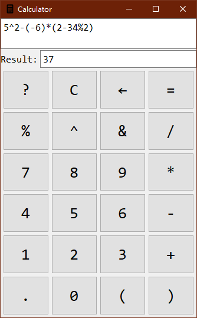

This is just yet another crappy calculator for school homework.

## Screenshots

## Manual (zh_cn)

### 运算符优先级

运算符 | 优先级 | 结合 | 备注
------|--------|------|----
+|1|左
-|1|左|亦可以作为单目运算符使用
*|2|左
/|2|左
%|3|左|取模运算
^|4|右
&|4|右|开方, a^b 等价于 a&(1/b)

功能：

- 计算功能
  - 可以计算绝大部分表达式
  - 支持多位数字的解析和负数的解析。
    - "-2+2", "2--2", "2-(-2)", "-(2*2)", "2+(-(3+4))"都是合法的表达式。

- 界面
  - 可以使用按钮输入也可以使用键盘输入。
  - 结果实时更新，等号实际上是个摆设。
  - 按C键可以清空。
